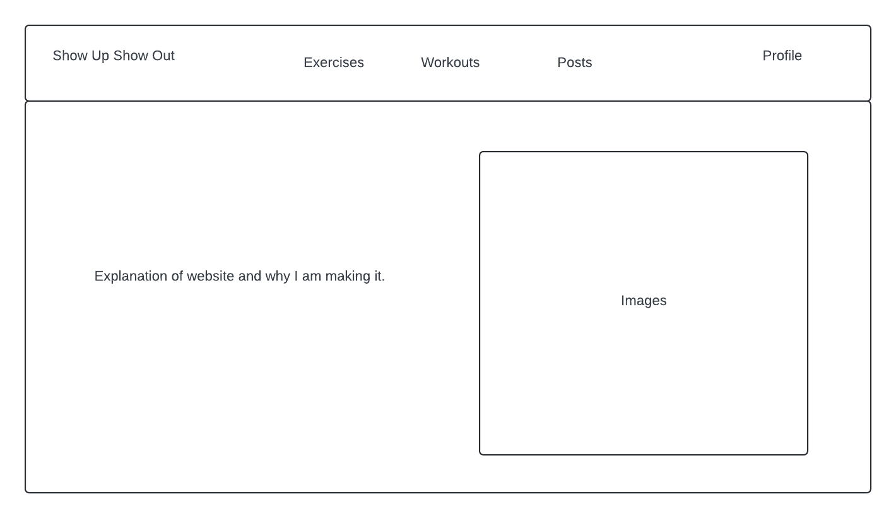
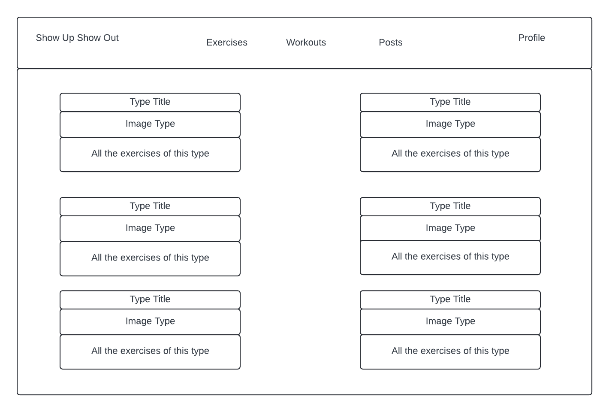

# Show up Show out (Exercise Website)

## Database Schema

.png>)

## Users

### Unauthorized & Not Logged In User Permission

- As an unauthorized and unregistered user, I should have access to the website’s `"/"` home page:
  - When on the Home Page:
    - I can see the nav bar that will allow me to see links to the workouts page, exercises page, and the posts page.
    - I can navigate across different workouts created by other users
    - I can navigate to the posts created by the users
    - On the posts page, when clicking the 'submit comment' button, I will be redirected to login

### Log-In / Sign-Up

- As an unauthorized and unregistered user, I should have access to the login form to enter my email and password.
  - If I am an existing user, I will enter my credentials and upon successful validation, be redirected to the home page at `"/"`.
  - If I am not an existing user, I will have the option to click a button called “Sign Up” and be redirected to the sign-up page at `"/auth-signup"`.
- As an unauthorized and unregistered user, after clicking the ‘Sign-Up’ button, I should have access to the sign-up form.
  - I should be able to enter my first name, last name, email address, password.
  - After successfully entering my information, I should be redirected to the home page at `"/"`.

## Exercises

- Either a logged in or unauthorized user can be able to view all of the exercises the users have created

- Create an Exercise (logged-in only)
  - As a logged-in user, when I am on the `"/exercises"` page, I should be able to see the "Create exercise" button.
  - When I click on the "Create exercise" button, I should be able to see a modal that will allow me to create an exercise
  - I should be able to fill out this modal form and post my exerice to the exercise page "/exerxises."
- Edit an exercise
  - For the exericises I create, I should see an 'edit' button.
  - when I click the edit button, I should be brought to a modal that will show me a prefilled form with the data from the exercise I want to edit.
  - There should be validations on the form to make sure the information submitted is allowed.
  - Once the 'Finish edit' button is clicked, I should be brought to the `"/exercises"` page.
- Delete an exercise
  - For the exercises I create, I should see a 'delete' button.
  - When I click the delete button, I should be brought to a modal that makes sure I want to delete the exercise that I have selected.
  - If I click yes, the exercise will be deleted and I will be redirected to the exercise website.
  - If I click no, the exercise will not be deleted and I will be redirected to the exercise website.

## Exercise Comments

- Either a logged in or unauthorized user can be able to view all of the comments under the exercises the users have created.

- Create an exercise comment (logged-in only)

  - I should be able to add a comment on any exercise created that is not my own.
  - I should see a text box underneath each exercise post that will be easy to spot so I can leave my comment.
  - Once I click submit on the comment. The comment will render at the bottom of all the other comments that have been previously created as well.

- Get all exercise comments

  - I should be able to view all the comments made underneath an exercise post.

- Edit exercise comments

  - I should be able to see an edit button on any exercise comments that are owned by me.
  - If I am not the owner of the comment, I will not see the edit button.
  - When I click the edit button, I should be brough to a modal that will display the form with the pre-filled data.
  - I should not be allowed to leave the desciption box empty. It should be filled with some info for the comment to be able to submit.

- Delete exercise comments
  - I should be able to delete all the comments that I own.
  - For any comment that I have made, I should see a delete button.
  - When clicking the delete button, a delete modal will pop up just to confirm that I want to delete the comment.
  - When I click yes, I will be brought back to the exercise post with my comment deleted.
  - When I click no, the modal will be closed and I will still be on the exercise post with my comment still there.

## MVP's Feauture's List

- Exercises
  - Create an exercsie
  - Get all exercises
  - Edit an exercise
  - Delete an exercise
- Exercise Comments

  - Create a exercise commment
  - Get all exercise comments
  - Edit an exercise comment
  - Delete a workout

- Post

  - Create a post
  - Get all posts

- Comment

  - Create a comment
  - Get all comments

- Bonus
  - Be able to choose a bunch of exercises and put it under one workout to be able to post.
  - Be able to create a workouts form that will only allow me to add exercises in that are of the same type.

## Wireframe

### Landing Page

### Exerxises Page

### Posts Page

.png>)
